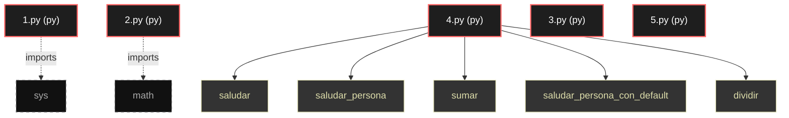

# Polyglot Codebase Knowledge Graph

> Generated offline by **readmenator**. 5 files, 5 symbols, 2 imports. Supports C, C++, Python, Go, Rust, JS/TS, Java, C#, Shell, PHP, Dart, GDScript, Nim, ASM, Ruby, Swift, Kotlin, Scala, Lua, Elixir.
> No LLMs. No tokens. Pure static analysis. See more [here](https://github.com/grisuno/ReadMenator)

**Start here:** Statistics Dashboard for scope, God Nodes for blast radius, Architecture Reference for per-file API. Agents: prefer `readmenator-agent/INDEX.md` + `SYMBOLS.md`.

**Wiki:** prefer `readmenator-wiki/index.md` for progressive disclosure: one synthesis page per community, `connections.json` with EXTRACTED vs INFERRED confidence, `queries.md` log, `REPORT.md` audit.

**Confidence:** EXTRACTED = parsed from source, INFERRED = heuristic bridge, AMBIGUOUS = reported, never hidden. See `readmenator-wiki/REPORT.md`.

**Total Files Parsed:** 5 | **Total Symbols Extracted:** 5 | **Total Imports:** 2

<!-- ranking_model: v1.0 | weights: {ppr:0.45,auth:0.2,test:0.15,doc:0.1,fresh:0.1} | alpha:0.85 | commit:b3ca3bb | date:2026-07-18 -->


## Table of Contents

1. [Statistics Dashboard](#statistics-dashboard)
2. [Architectural Layers](#architectural-layers)
3. [Ranked Context](#ranked-context)
4. [God Nodes](#god-nodes)
5. [Suggested Questions](#suggested-questions)
6. [Hotspot Analysis](#hotspot-analysis)
7. [Change Impact Analysis](#change-impact-analysis)
8. [Suggested Linting Rules](#suggested-linting-rules)
9. [Query Recipes](#query-recipes)
10. [Structural Knowledge Map](#structural-knowledge-map)
11. [UML Class Diagram](#uml-class-diagram)
12. [Code Property Graph](#code-property-graph)
13. [Architecture Reference](#architecture-reference)
    - [PY (5 files)](#py-5-files)

---

## Statistics Dashboard

| Metric | Value |
|--------|-------|
| Total Files | 5 |
| Total Symbols | 5 |
| Total Imports | 2 |
| Call Edges | 6 |
| Inheritance Edges | 0 |
| Languages | 1 |
| Avg Symbols/File | 1.0 |
| Avg Imports/File | 0.4 |

### Top Files by Import Count (Fan-Out)

| File | Imports | Symbols | Language |
|------|---------|---------|----------|
| `1.py` | 1 | 0 | py |
| `2.py` | 1 | 0 | py |

---

## Architectural Layers

Auto-detected from path patterns, naming conventions, and imported frameworks.

| Layer | Files |
|-------|-------|
| utility | 5 |

### utility

- `1.py` (py, 0 symbols)
- `2.py` (py, 0 symbols)
- `3.py` (py, 0 symbols)
- `4.py` (py, 5 symbols)
- `5.py` (py, 0 symbols)

---

## Ranked Context

Files ranked by composite score for the current query context. The ranking combines Personalized PageRank (query relevance), global authority, test coverage, documentation coverage, and code freshness. Model: v1.0.

| Rank | File | Composite | PPR | Authority | Test | Doc |
|------|------|-----------|-----|-----------|------|-----|
| 1 | `1.py` | 0.1000 | 0.0000 | 0.0000 | 0.00 | 1.00 |
| 2 | `2.py` | 0.1000 | 0.0000 | 0.0000 | 0.00 | 1.00 |
| 3 | `3.py` | 0.1000 | 0.0000 | 0.0000 | 0.00 | 1.00 |
| 4 | `5.py` | 0.1000 | 0.0000 | 0.0000 | 0.00 | 1.00 |
| 5 | `4.py` | 0.0200 | 0.0000 | 0.0000 | 0.00 | 0.20 |

---

## God Nodes

Most architecturally central files ranked by combined import/export degree and symbol richness.

| File | Score | Connections | PageRank |
|------|-------|-------------|----------|
| `4.py` | 0.5 | | 0.0000 |
| `1.py` | 0.0 | | 0.0000 |
| `2.py` | 0.0 | | 0.0000 |
| `3.py` | 0.0 | | 0.0000 |
| `5.py` | 0.0 | | 0.0000 |

---

## Suggested Questions

Auto-generated exploration prompts based on graph structure:

- What does 4.py depend on, and what depends on it? (0 connections)
- What does 1.py depend on, and what depends on it? (0 connections)
- What does 2.py depend on, and what depends on it? (0 connections)
- What is the overall architecture of this codebase?

---

## Hotspot Analysis

Files ranked by combined complexity (symbol count) and centrality (connection count). High-scoring files are architecturally critical and may need refactoring attention.

| File | Complexity | Centrality | Combined | Symbols | Connections |
|------|-----------|------------|----------|---------|-------------|
| `1.py` | 0.000 | 1.000 | 0.600 | 0 | 1 |
| `2.py` | 0.000 | 1.000 | 0.600 | 0 | 1 |
| `3.py` | 0.000 | 0.000 | 0.000 | 0 | 0 |
| `5.py` | 0.000 | 0.000 | 0.000 | 0 | 0 |
| `4.py` | 1.000 | 0.000 | 0.400 | 5 | 0 |

---

## Change Impact Analysis

Files sorted by how many other files would be affected if they changed. High-impact files should be changed with caution.

| File | Direct Dependents | Transitive Dependents | Total Impact |
|------|------------------|----------------------|--------------|
| `1.py` | 0 | 0 | 0 |
| `2.py` | 0 | 0 | 0 |
| `3.py` | 0 | 0 | 0 |
| `4.py` | 0 | 0 | 0 |
| `5.py` | 0 | 0 | 0 |

---

## Suggested Linting Rules

Automatically suggested linting and security rules based on patterns detected in the codebase. These can be exported as Semgrep rules using the `--export-rules` flag.

| Rule ID | Severity | Description | Language | Matches |
|---------|----------|-------------|----------|---------|
| `RM001` | info | Large number of functions in py: 5 total | py | 5 |
| `RM002` | info | Print statement found (consider logging instead) | python | 46 |

---

## Query Recipes

Example queries you can run against this knowledge base using the ranking engine:

```
# Find files most relevant to a concept
readmenator query "Where is the import resolver implemented?"

# Rank files by relevance to a topic
readmenator query "How does documentation generation work?"

# Explain why a file ranks highly
readmenator query "explain readmenator/_documentation.py"

# Trace dependency paths with ranked context
readmenator query "path from CLI to exporter"
```

The ranking model uses the following signals:

- **Personalized PageRank** (45% weight): query-specific relevance via seed propagation
- **Global Authority** (20% weight): structural importance via standard PageRank
- **Test Coverage** (15% weight): fraction of symbols referenced in test files
- **Doc Coverage** (10% weight): presence of docstrings and file-level docs
- **Freshness** (10% weight): recent modification activity

Results include score decomposition and justification paths for each ranked item.

---

## Structural Knowledge Map



---

## Code Property Graph

Machine-readable Code Property Graph (CPG) in JSON-LD format. This block allows AI agents to parse the full structural graph without additional file reads. Compatible with GraphRAG pipelines.

```json
{"@context": "https://schema.org", "analysis": {"communities": [], "god_nodes": [{"node_id": "4.py", "score": 0.5}, {"node_id": "1.py", "score": 0.0}, {"node_id": "2.py", "score": 0.0}, {"node_id": "3.py", "score": 0.0}, {"node_id": "5.py", "score": 0.0}], "surprising_connections": []}, "edges": [{"confidence": "EXTRACTED", "relation": "imports", "source": "1.py", "target": "sys"}, {"confidence": "EXTRACTED", "relation": "imports", "source": "2.py", "target": "math"}], "generator": "readmenator", "metadata": {"edge_count": 8, "file_count": 5, "language_count": 1, "symbol_count": 5}, "nodes": [{"doc": "Script 1: Introducción a Python  Este es el primer script de una serie de tutoriales en Python. En este script, cubriremos los conceptos básicos de Python, como imprimir en la consola, comentarios, y variables.  Importar la librería sys para obtener información del sistema", "id": "1.py", "kind": "module", "label": "1.py", "language": "py", "sha256": "85de88cf9515cc4e", "symbol_count": 0, "symbols": []}, {"doc": "Script 2: Operaciones Básicas y Estructuras de Control  En este segundo script, exploraremos las operaciones básicas y las estructuras de control en Python. Aprenderemos cómo realizar operaciones matemáticas, usar condicionales y loops.  Importar la librería math para operaciones matemáticas avanzadas", "id": "2.py", "kind": "module", "label": "2.py", "language": "py", "sha256": "34bcecac50a96ac1", "symbol_count": 0, "symbols": []}, {"doc": "Script 3: Listas, Tuplas y Diccionarios  En este tercer script, exploraremos las estructuras de datos más comunes en Python: listas, tuplas y diccionarios. Aprenderemos cómo crearlas, acceder a sus elementos y manipularlos.  Listas Las listas son colecciones ordenadas y mutables que permiten elementos duplicados.  Crear una lista", "id": "3.py", "kind": "module", "label": "3.py", "language": "py", "sha256": "7d1357af55d3e6c7", "symbol_count": 0, "symbols": []}, {"doc": "Script 4: Funciones y Manejo de Errores  En este cuarto script, aprenderemos a definir y usar funciones en Python, así como a manejar errores mediante excepciones.  Funciones Las funciones son bloques de código que realizan una tarea específica y pueden ser reutilizadas.  Definir una función simple", "id": "4.py", "kind": "module", "label": "4.py", "language": "py", "sha256": "9ea79b6cceb232b9", "symbol_count": 5, "symbols": [{"kind": "function", "line": 9, "name": "saludar", "signature": "def saludar()"}, {"kind": "function", "line": 16, "name": "saludar_persona", "signature": "def saludar_persona(nombre)"}, {"kind": "function", "line": 23, "name": "sumar", "signature": "def sumar(a, b)"}, {"kind": "function", "line": 31, "name": "saludar_persona_con_default", "signature": "def saludar_persona_con_default(nombre)"}, {"kind": "function", "line": 43, "name": "dividir", "signature": "def dividir(a, b)"}]}, {"doc": "Script 5: Manipulación de Archivos  En este quinto script, aprenderemos cómo trabajar con archivos en Python. Veremos cómo abrir, leer, escribir y cerrar archivos, así como algunos métodos útiles para la manipulación de archivos.  Abrir y leer un archivo La función open() se usa para abrir archivos. El primer argumento es la ruta del archivo y el segundo argumento es el modo. 'r' para leer, 'w' para escribir (sobrescribiendo el archivo si existe), 'a' para agregar, y 'b' para modos binarios.  Leer todo el contenido de un archivo", "id": "5.py", "kind": "module", "label": "5.py", "language": "py", "sha256": "406c670bf87a2a57", "symbol_count": 0, "symbols": []}], "type": "CodePropertyGraph", "version": "1.0"}
```

---

## Architecture Reference

### PY (5 files)

#### `1.py`
**Path:** `1.py`
**File Doc:** *Script 1: Introducción a Python  Este es el primer script de una serie de tutoriales en Python. En este script, cubriremos los conceptos básicos de Python, como imprimir en la consola, comentarios, y variables.  Importar la librería sys para obtener información del sistema*

*No symbols extracted*

#### `2.py`
**Path:** `2.py`
**File Doc:** *Script 2: Operaciones Básicas y Estructuras de Control  En este segundo script, exploraremos las operaciones básicas y las estructuras de control en Python. Aprenderemos cómo realizar operaciones matemáticas, usar condicionales y loops.  Importar la librería math para operaciones matemáticas avanzadas*

*No symbols extracted*

#### `3.py`
**Path:** `3.py`
**File Doc:** *Script 3: Listas, Tuplas y Diccionarios  En este tercer script, exploraremos las estructuras de datos más comunes en Python: listas, tuplas y diccionarios. Aprenderemos cómo crearlas, acceder a sus elementos y manipularlos.  Listas Las listas son colecciones ordenadas y mutables que permiten elementos duplicados.  Crear una lista*

*No symbols extracted*

#### `4.py`
**Path:** `4.py`
**File Doc:** *Script 4: Funciones y Manejo de Errores  En este cuarto script, aprenderemos a definir y usar funciones en Python, así como a manejar errores mediante excepciones.  Funciones Las funciones son bloques de código que realizan una tarea específica y pueden ser reutilizadas.  Definir una función simple*

**Functions:**
- `saludar` (line 9) `def saludar()`
- `saludar_persona` (line 16) `def saludar_persona(nombre)`
- `sumar` (line 23) `def sumar(a, b)`
- `saludar_persona_con_default` (line 31) `def saludar_persona_con_default(nombre)`
- `dividir` (line 43) `def dividir(a, b)`

#### `5.py`
**Path:** `5.py`
**File Doc:** *Script 5: Manipulación de Archivos  En este quinto script, aprenderemos cómo trabajar con archivos en Python. Veremos cómo abrir, leer, escribir y cerrar archivos, así como algunos métodos útiles para la manipulación de archivos.  Abrir y leer un archivo La función open() se usa para abrir archivos. El primer argumento es la ruta del archivo y el segundo argumento es el modo. 'r' para leer, 'w' para escribir (sobrescribiendo el archivo si existe), 'a' para agregar, y 'b' para modos binarios.  Leer todo el contenido de un archivo*

*No symbols extracted*
