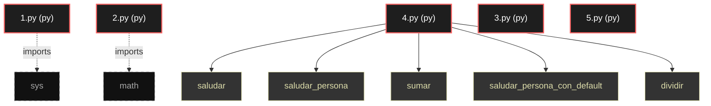

# Polyglot Codebase Knowledge Graph

> Generated offline by **readmenator**. Supports C, C++, Python, Go, Rust, JS/TS, Java, C#, Shell, PHP, Dart, GDScript, Nim, ASM.
> No LLMs. No tokens. Pure static analysis. See more [here](https://github.com/grisuno/ReadMenator)

**Total Files Parsed:** 5 | **Total Symbols Extracted:** 5 | **Total Imports:** 2

## Structural Knowledge Map

---

## Architecture Reference

### PY (5 files)

#### `1.py`
**Path:** `1.py`

*No symbols extracted*

#### `2.py`
**Path:** `2.py`

*No symbols extracted*

#### `3.py`
**Path:** `3.py`

*No symbols extracted*

#### `4.py`
**Path:** `4.py`

**Functions:**
- `saludar` (line 9) `def saludar()`
- `saludar_persona` (line 16) `def saludar_persona(nombre)`
- `sumar` (line 23) `def sumar(a, b)`
- `saludar_persona_con_default` (line 31) `def saludar_persona_con_default(nombre)`
- `dividir` (line 43) `def dividir(a, b)`

#### `5.py`
**Path:** `5.py`

*No symbols extracted*
